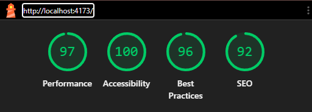
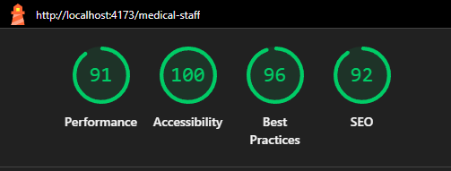
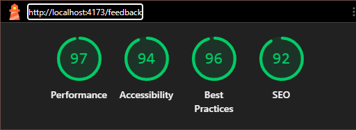

# HCare

HCare is a responsive healthcare dashboard built with React and TypeScript. The application provides patient information, medical staff data, appointment details, feedback forms, surveys, activity history, and contact preferences.

The interface is adapted for desktop, tablet, and mobile screens.

## Live Demo

[Open deployed application](https://h-care-two.vercel.app/)

## Features

The application includes three main pages:

### Patient Dashboard

The main page displays:

- patient profile information;
- contact and personal information;
- recent patient activities;
- appointments;
- insurance information;
- surveys;
- feedback history;
- contact preferences.

Patient data is loaded from the DummyJSON API.

Route:

```text
/
```

### Medical Staff

The Medical Staff page displays a responsive table containing:

- employee name and photo;
- clinic and position;
- city and country;
- available working hours;
- appointment booking action;
- confirmation status.

Medical staff data is loaded from the DummyJSON API.

Route:

```text
/medical-staff
```

### Feedback

The Feedback page contains a responsive satisfaction survey where users can rate:

- the appointment booking experience;
- the doctor consultation experience.

Route:

```text
/feedback
```

## Technology Stack

- React 19
- TypeScript
- Vite
- TanStack Router
- TanStack Query
- Tailwind CSS
- ESLint
- DummyJSON API

## Main Dependencies

### Production dependencies

| Dependency               | Purpose                                            |
| ------------------------ | -------------------------------------------------- |
| `react`                  | Building the user interface                        |
| `react-dom`              | Rendering the React application                    |
| `@tanstack/react-router` | Type-safe application routing                      |
| `@tanstack/react-query`  | API requests, caching, and server-state management |
| `tailwindcss`            | Utility-first application styling                  |

### Development dependencies

| Dependency                    | Purpose                                 |
| ----------------------------- | --------------------------------------- |
| `typescript`                  | Static type checking                    |
| `vite`                        | Development server and production build |
| `@vitejs/plugin-react`        | React integration for Vite              |
| `@tailwindcss/vite`           | Tailwind CSS integration for Vite       |
| `eslint`                      | Code quality validation                 |
| `typescript-eslint`           | TypeScript ESLint support               |
| `eslint-plugin-react-hooks`   | Validation of React Hooks rules         |
| `eslint-plugin-react-refresh` | React Fast Refresh validation           |
| `@tanstack/router-plugin`     | File-based route generation             |
| `@types/react`                | React TypeScript definitions            |
| `@types/react-dom`            | React DOM TypeScript definitions        |
| `@types/node`                 | Node.js TypeScript definitions          |

## Project Structure

The project uses a modular structure. Feature-specific components, API requests, hooks, and types are grouped by application domain.

```text
├── public
│   ├── favicon.svg
│   ├── icons.svg
│   └── robots.txt
├── src
│   ├── assets
│   │   ├── lighthouse
│   │   │   ├── Feedback.png
│   │   │   ├── MedicalStaff.png
│   │   │   └── Patient.png
│   │   ├── svgs
│   │   │   ├── AddBtnGreen.tsx
│   │   │   ├── AddDateBtn.tsx
│   │   │   ├── BurgerMenu.tsx
│   │   │   ├── CalendarIcon.tsx
│   │   │   ├── EditBtnGray.tsx
│   │   │   ├── EditBtnGreen.tsx
│   │   │   ├── IncomingCallIcon.tsx
│   │   │   ├── LinkIcon.tsx
│   │   │   ├── Notifications.tsx
│   │   │   ├── OutgoingCallIcon.tsx
│   │   │   ├── PersonIcon.tsx
│   │   │   ├── SettingIcon.tsx
│   │   │   ├── SMSIcon.tsx
│   │   │   └── StarIcon.tsx
│   │   ├── FeedbackBG.webp
│   │   └── HCareIcon.png
│   ├── components
│   │   ├── common
│   │   │   ├── IconButton.tsx
│   │   │   ├── PageCard.tsx
│   │   │   └── SectionCard.tsx
│   │   ├── feedback
│   │   │   └── components
│   │   │       └── RatingQuestion.tsx
│   │   ├── layout
│   │   │   └── Header.tsx
│   │   ├── medical-staff
│   │   │   ├── api
│   │   │   │   └── medicalStaffApi.ts
│   │   │   ├── components
│   │   │   │   └── MedicalStaffRow.tsx
│   │   │   ├── hooks
│   │   │   │   └── useMedicalStaff.ts
│   │   │   └── types
│   │   │       └── medicalStaff.ts
│   │   └── patient
│   │       ├── api
│   │       │   └── patientApi.ts
│   │       ├── components
│   │       │   ├── ActivityItem.tsx
│   │       │   ├── ActivityTabs.tsx
│   │       │   ├── AppointmentsTable.tsx
│   │       │   ├── ContactMethod.tsx
│   │       │   ├── FeedbackTable.tsx
│   │       │   ├── InfoList.tsx
│   │       │   ├── PatientTabs.tsx
│   │       │   └── SurveysTable.tsx
│   │       ├── hooks
│   │       │   └── usePatient.ts
│   │       └── types
│   │           └── patient.ts
│   ├── pages
│   │   ├── Feedback
│   │   │   └── Feedback.tsx
│   │   ├── MainPage
│   │   │   ├── MainPage.css
│   │   │   └── MainPage.tsx
│   │   └── MedicalStaff
│   │       └── MedicalStaff.tsx
│   ├── routes
│   │   ├── __root.tsx
│   │   ├── feedback.tsx
│   │   ├── index.tsx
│   │   └── medical-staff.tsx
│   ├── App.tsx
│   ├── index.css
│   ├── main.tsx
│   ├── router.ts
│   └── routeTree.gen.ts
├── eslint.config.js
├── index.html
├── package-lock.json
├── package.json
├── README.md
├── tsconfig.app.json
├── tsconfig.json
├── tsconfig.node.json
├── vercel.json
└── vite.config.ts
```

The main directories are organized as follows:

- `assets` contains images, Lighthouse reports, and SVG components;
- `components/common` contains reusable UI components shared across the application;
- `components/layout` contains application layout components;
- `components/patient` contains patient-related API logic, hooks, types, and UI components;
- `components/medical-staff` contains medical-staff-related API logic, hooks, types, and UI components;
- `components/feedback` contains components used by the feedback page;
- `pages` contains the main application pages;
- `routes` contains the TanStack Router file-based route configuration.

````

The application separates:

- API logic;
- server-state management;
- TypeScript data models;
- reusable interface components;
- page-level components;
- routing configuration.

## Getting Started

### Requirements

Install the following software before running the project:

- Node.js 20.19 or newer
- npm

Check the installed versions:

```bash
node --version
npm --version
````

### Clone the repository

```bash
git clone https://github.com/AleksandrGubich/HCare
cd hcare
```

### Install dependencies

```bash
npm install
```

### Start the development server

```bash
npm run dev
```

Open the address displayed by Vite in the terminal. The default address is usually:

```text
http://localhost:5173
```

## Production Build

Create an optimized production build:

```bash
npm run build
```

The generated files will be placed in:

```text
dist/
```

Preview the production build locally:

```bash
npm run preview
```

The preview server usually starts at:

```text
http://localhost:4173
```

## Code Quality

Run ESLint:

```bash
npm run lint
```

Run TypeScript validation and create the production build:

```bash
npm run build
```

Before deployment, both commands should finish without errors.

The final project validation includes:

- no TypeScript compilation errors;
- no ESLint errors;
- no browser console errors;
- no HTML validation errors;
- no CSS validation errors;
- no JavaScript runtime errors.

## Quality Tool Report

The application was tested with Lighthouse in production mode.

The required minimum result is **90 points in every category**:

- Performance;
- Accessibility;
- Best Practices;
- SEO.

### Patient Page

Route:

```text
/
```



### Medical Staff Page

Route:

```text
/medical-staff
```



### Feedback Page

Route:

```text
/feedback
```



The screenshots contain the Lighthouse reports for the main application pages.

Lighthouse results should be checked again after the final deployment because network conditions, hosting configuration, and production caching can affect the scores.

## Running Lighthouse Tests

Build and preview the production version:

```bash
npm run build
npm run preview
```

Then:

1. Open the application in Google Chrome.
2. Open Chrome DevTools.
3. Select the **Lighthouse** tab.
4. Select **Navigation** mode.
5. Select the required device type.
6. Enable:

   - Performance;
   - Accessibility;
   - Best Practices;
   - SEO.

7. Run the audit for each route:

   - `/`;
   - `/medical-staff`;
   - `/feedback`.

8. Confirm that every result is at least 90.

## API

The application uses the DummyJSON Users API.

Patient endpoint:

```text
https://dummyjson.com/users/1
```

Medical staff endpoint:

```text
https://dummyjson.com/users?limit=10
```

TanStack Query is used for:

- loading API data;
- caching responses;
- controlling retries;
- handling loading states;
- handling error states;
- preventing unnecessary refetching.

## Responsive Design

The interface supports:

- mobile screens;
- tablets;
- laptops;
- desktop monitors.

Responsive behavior includes:

- adaptive page padding;
- responsive grid layouts;
- horizontally scrollable data tables;
- mobile-friendly navigation;
- flexible cards and content sections;
- accessible buttons and controls.

## Accessibility

The project includes:

- semantic heading structure;
- descriptive image alternative text;
- accessible button names;
- `aria-label` attributes for icon buttons;
- navigation menu state attributes;
- visible keyboard focus styles;
- improved text contrast;
- descriptive rating controls.
